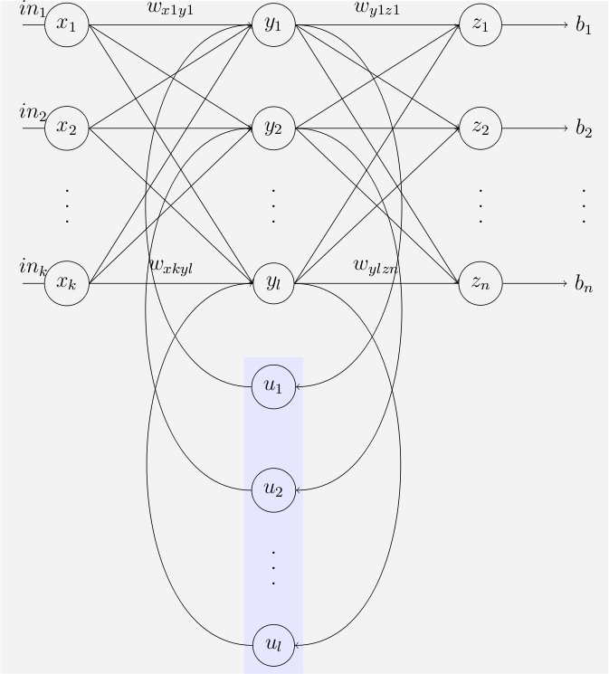
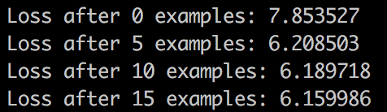

<h1 align="center">The Grateful Net</h1>

A tribute to the Grateful Dead.

# Concept
Recurrent Neural Networks are a class of machine learning models.  They are similar to a classic neural network, however they "remember" their previous states.  This is very useful when dealing with sequences, including but not limited to natural language.  We will be training out network model on music lyrics, and hopefully we will get some interesting music lyrics out.
___

   Recurrent Neural Network diagram from Wikipedia that I found useful

___

# Goals

My Goal in this project is to demystify a few machine learning algorithms.  When I hear backpropagation, I know it is an algorithm to train a neural network; but how exactly does this work?  Through this project I will clarify this among other questions relating to RNNs.

# Notation
Inside of my neural network implementation you will find symbols that follow this notation.  If you are following along this is their meaning.  This is fairly standard notation when discussing math, particularly in relation to neural nets. 
xt corresponds to input at step t. 
st is the state at step t.  This is what allows our network to "remember" previous inputs. 
st = f(Uxt + Wst-1), we define out function f as a nonlinearity.  I will be using tanh for this (defined below).  U and W are parameters to our neural network (we will also cover this later)
ot is the output at step t.

# Initial Thoughts and Predictions
My first guess is that the network will naturally tend to distinguish between nouns, verbs and adjectives.  My hope is that the network will also quickly understand where to place punctuation.  I hope that the network will be able to write coherent sentences after a relatively short period of time.  Vanilla Recurrent Neural Networks have a reputation of being pretty poor at natural language analysis, however I believe that song lyrics are far simpler than normal language and believe that our network will be fairly effective.

# Literature
To start this project, I have gone through some literature that I found essential to the understanding and creation of a Recurrent Neural Network. 

## Basic Definitions
[**One-hot Vector**](https://en.wikipedia.org/wiki/One-hot) refers to a group of bits among which the legal combinations of values are only those with a single high 

## Numpy
 [Basic Tutorial](https://docs.scipy.org/doc/numpy-dev/user/quickstart.html)
 > Numpy is an expansive mathematics library for python.  I will be making great use the linear algebra functionality.

 [Full Documentation](https://docs.scipy.org/doc/numpy-1.11.0/reference/)
 > Having a strong foundation in numpy is essential in modeling networks in python.

## Equations
 tanh(x) = (ex - e-x) / (ex + e-x)
 > tanh is our nonlinear function that we will use to determine our state at each step.

## Algorithms
 [Loss Function](https://en.wikipedia.org/wiki/Loss_function)
 Also known as a cost function, this function maps a set of values to the "cost" of running them.  This allows us to optimize our neural network based on the values at each step.  For example a cost could be defined as the amount of information lost between states, or the difference between our perfect output and our expected output.
___
 [Gradient Descent](https://en.wikipedia.org/wiki/Gradient_descent)
 Gradient Descent is an algorithm used to solve a system of linear equations.  This is essential to our backpropogation algorithm.
___
 [Backwards Error Propogation (backpropogation for short)](https://en.wikipedia.org/wiki/Backpropagation)
 Backpropogation stands for Backwards Error Propogation.  In order to use this algorithm we must define a few things.  We must have a series of vectors that all lie in the same space. The following series of vectors are defined as follows: 
Xinputs = x, x1, x2, ... 
Youtputs = y, y1, y2, ... 
Wweights = w, w1, w2, ... 
 
We have y = fN(w, x) 
We also select an error function given by E(y,y1) 0
Our standard choice of an error function is E = |y-y1|2 
 Our output from this algorithm is an optimized series of weights that will allow us to transform xi => yi 
  
Now onto the actual algorithm: 
**Step 1:**  Randomly assign weights w, w1 ... wn.  We take a series of example inputs that we already have desired outputs for.  This is denoted as our training set. 
**Step 2:**  Forward Propagate a training input to get an output for the training input 
**Step 3:**  Backwards Propagation to generate the error, which is difference between the targeted and actual output values, of each output in the hidden layers. 
**Step 4:**  Update Weights by multipying the error and input value and subtracting that value from the weight at layer value i. 
**Step 5:**  Repeat until we have our desired output set (as defined by you). 
___
 [Backpropogation Through Time (this shows up as bppt in our implementation)](http://minds.jacobs-university.de/sites/default/files/uploads/papers/ESNTutorialRev.pdf)
One very interesting fact about Backpropogation Through Time (BPTT) is that it has been derived by various researchers with no intercommunication between them.  This suggests that this algorithm is a fairly intuitive solution to solving the problem of training recurrent neural networks.   
The algorithm performs the following steps: 

**Step 1:**  Get training data in the format of ordered pairs.  This could be for example the pixels in an image up until a specific point with the output being the next pixel in the image. 
**Step 2:**  "Unfold" the network.  In simple terms, this means that we need to look at each hidden layer independantly.   
**Step 3:**  Initialize a vector, x0 to contain a set of all zeros.  This represents the intial state of our network. 
**Step 4:**  For each time step that impacts our output, can also be thought of as the depth of the networks memory or the number of hidden layers, feed in a piece of training data the corresponds to that time frame.  Calculate the networks current output and find the error compared to the desired output using our Loss function as defined above. 
**Step 5:**  This is where we really differ from backpropogation.  We now backpropogate the error through every layer in the unfolded network.  This updates the weights at every layer and allows us to lower the loss associated with this piece of training data essentially "teaching" the network something. 
**Step 6:**  Replace our initialization vector x0 with the output computed.  This serves as the existing memory that the network would have at this point in time. 
**Step 7:**  Repeat until we reach our stopping criteria. 

## Neural Networks
 [Forward Feed Network](https://en.wikipedia.org/wiki/Feedforward_neural_network) 
 [Recurrent Neural Network](https://en.wikipedia.org/wiki/Recurrent_neural_network) 
 [LSTM](https://en.wikipedia.org/wiki/Long_short-term_memory) 
 
# Implementation Steps
1. Implement a vanilla Recurrent Neural Network
2. Allow storage of networks to prevent the need for re-loading
3. Create a web page allowing people to see sample outputs of the network.
4. Optimize Network (Possibly moving to a Long Term Short Memory model)

# Results
After implementing my vanilla recurrent neural network, I trained it for one hour on the GPU of a macbook.  This yielded the following results:

1.)  Adjectives are rarely adjacent to one another.  This is good, the network has quickly found a correlation between the classes of words (Noun, Verb, Adjective).

2.)  There is still a great deal of incoherent text.  This is due to a combination of limited training resources, as well as the type of neural network.  Vanilla recurrent neural networks are pretty poor at working with natural language.

3.)  Having a noun selected recently makes it much more likely to show up again in the near future.  This is good!  We see repetition of nouns in the original songs a great deal.  

# Analysis
When training the network, we typically get an initial starting error rate of 7.8~.  This is because the error rate of randomly selecting words is approximately 7.8 using the loss function we defined above.  After training for 15 minutes, I consistently got an error rate of approximately 6.1.
 
Here is a screenshot of the training convergence:

In the following period of time, the network quickly converges to a loss average of 5.  This is a point of convergence and while further training helps, the benefit is marginal.  This suggests that our recurrent neural network model is pretty poor at modeling the lyrics of the Grateful Dead.  

# Going Forwards
In the near future, I will improve the GratefulNet by changing it to a Long Short Term Memory (LSTM) network.  These have consistently proven better at natural language production and analysis.  This should yield better results.  I also plan to change some of the parameters I use.  I.E.: hidden layer size, number of hidden layers, weighting of random word selection.

# Samples From One Hour of Training
[Samples of the results](https://lukewoodsmu.github.io/theGratefulNet)
